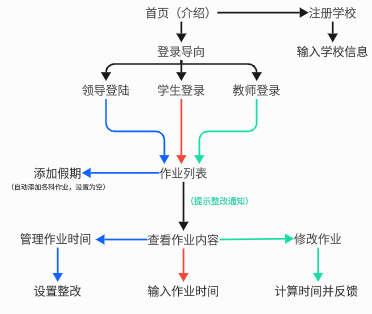

# 作业时间

用于计算作业时间并在网站中展示



## Flask应用说明

这是一个基础的Flask Web应用程序。

### 环境要求
- Python 3.7+
- Flask

### 安装依赖
```bash
pip install flask
```

### 运行应用
```bash
python main.py
```

应用将在 `http://127.0.0.1:5000` 启动


